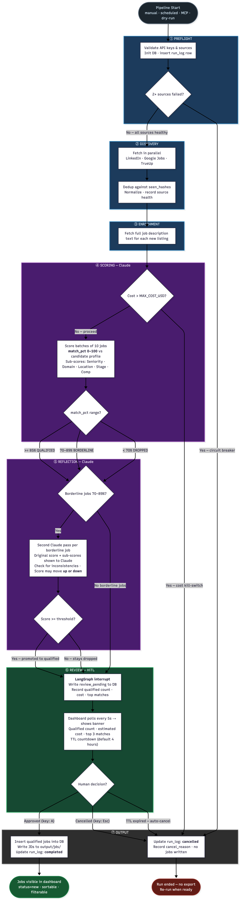
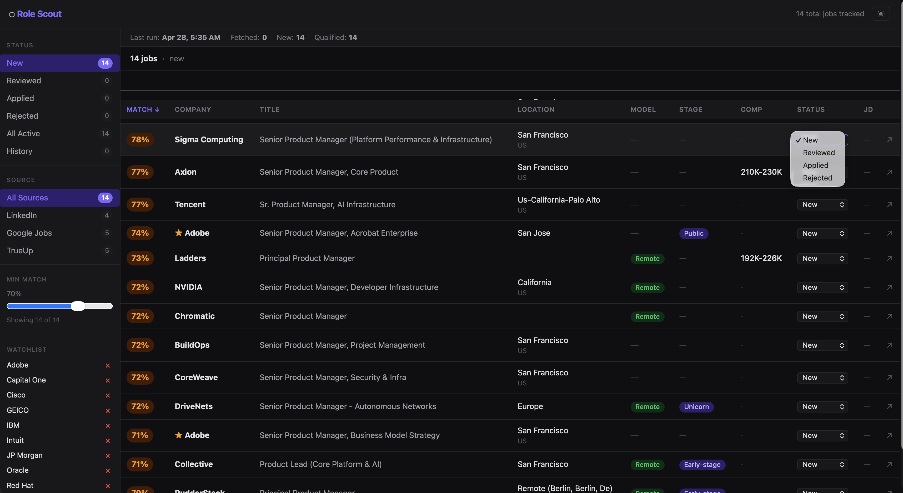
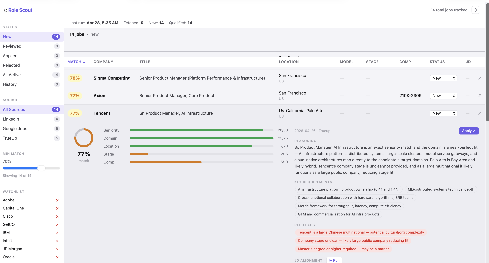
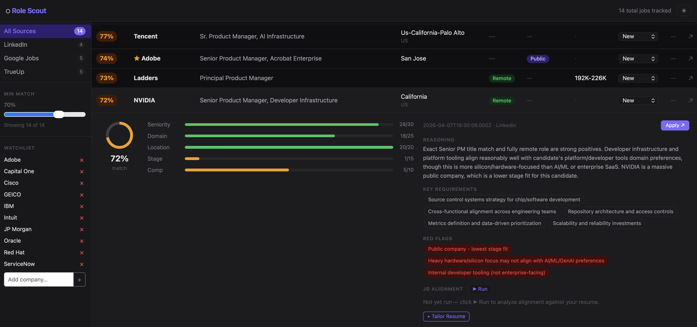

# Role Scout

**Automated job search pipeline with AI scoring, agentic review, and resume tailoring.**

Role Scout fetches job listings from multiple sources, scores them against your resume using Claude, flags the most relevant ones for human review, and generates tailored resume bullets on demand. It runs on a schedule, surfaces results through a lightweight web dashboard, and exposes a conversational interface via Claude Code's MCP protocol.

---

## Why Role Scout?

Job searching is repetitive and noisy. Role Scout solves three specific problems:

1. **Signal-to-noise**: Most job boards return hundreds of results. Role Scout scores each listing against your actual resume and work preferences, filters to the matches that matter, and explains why each scored the way it did.

2. **Review without micromanagement**: The pipeline runs automatically (Mon/Thu mornings via launchd), pauses for your approval before exporting, and cancels itself if you don't respond within 4 hours — no orphaned state.

3. **Application prep**: For each qualified job, one click generates Claude-tailored resume bullets, a professional summary, and a keyword list extracted from the job description. No copy-pasting between tabs.

---

## Architecture



Role Scout is a single self-contained repository. Phase 1 (the linear fetch-normalize-score pipeline, originally `auto_jobsearch`) has been absorbed into `src/role_scout/compat/` as a frozen sub-package. There is no sibling repo required — a single `git clone` + `uv sync` is all you need.

```
┌──────────────────────────────────────────────────────────────┐
│  Agentic Layer                                               │
│                                                              │
│  LangGraph DAG ──► HiTL interrupt ──► Flask dashboard        │
│       │                                    │                 │
│   Reflection                          MCP server             │
│   (borderline                     (Claude Code CLI)          │
│    70-89% re-score)                                          │
└────────────────────────┬─────────────────────────────────────┘
                         │ imports from
┌────────────────────────▼─────────────────────────────────────┐
│  compat/ — Phase 1 linear pipeline (frozen — never modify)   │
│                                                              │
│  fetch → normalize → dedup → enrich → score                  │
│  (LinkedIn · Google Jobs · TrueUp email alerts)              │
└──────────────────────────────────────────────────────────────┘
```

### LangGraph pipeline nodes

| Node | What it does |
|------|-------------|
| **preflight** | Validates sources, checks SerpAPI quota, applies circuit breaker if ≥2 sources fail |
| **discovery** | Fetches jobs from all active sources in parallel; records per-source health |
| **normalize** | Deduplicates and normalises raw listings; trims raw_by_source from state |
| **enrichment** | Fetches full job descriptions where needed |
| **scoring** | Sends enriched jobs to Claude in batches of 10. Each job gets a `match_pct` (0–100) and per-dimension subscores against your candidate profile. Before the first batch starts, checks whether Claude API spend so far in this run has already exceeded `MAX_COST_USD` (set in `.env`, default $5.00 — a safety cap you control) and cancels the run if so. |
| **reflection** | For every job that scored in the borderline band (70–89%), sends a second Claude call with the original score and subscores and asks it to check for internal inconsistencies. Scores may move up or down; jobs that clear the qualify threshold after reflection are promoted to qualified. Skipped entirely if no borderline jobs exist. |
| **review** | Issues a LangGraph `interrupt()` that suspends the graph and waits for a human decision. Scheduled and MCP-triggered runs bypass this and auto-approve. Manual runs surface an Approve / Cancel banner in the dashboard (or a CLI prompt). If no decision arrives within `INTERRUPT_TTL_HOURS` (default 4 h) the TTL watcher resumes the graph with `cancel_reason=ttl_expired`. |
| **output** | Terminal node — always runs regardless of approval or cancellation. On approval: inserts qualified jobs into `qualified_jobs`, writes each job description to `output/jds/<hash_id>.txt`, and records the completed run (token counts, cost, source health) in `run_log`. On cancellation: records the cancel reason in `run_log` and exits. Dry-run mode skips all writes. |

**HiTL flow**: the graph pauses at `review`. The Flask dashboard polls `/api/pipeline/status` every 5 seconds and renders an approval banner. You click Approve or Cancel (or use keyboard shortcuts A / Esc). If no response arrives within 4 hours the run auto-cancels and is logged as `cancel_reason=ttl_expired`.

---

## Features

### Dashboard



- Qualified jobs table with 11 columns: title, company, location, work model, stage, comp, score, source, status, external link, tailor
- Sortable columns — click any header to toggle ascending/descending; active sort and direction preserved in URL
- Sidebar status filters: New / Reviewed / Applied / Rejected / All Active / History with live per-status counts
- Sidebar source filters: All / LinkedIn / Google Jobs / TrueUp
- Threshold slider — **display filter only**, never re-scores; hides rows below the chosen match %
- Expandable detail rows with animated SVG score ring, per-dimension score bars (Seniority / Domain / Location / Stage / Comp), and Claude's scoring reasoning




- Inline status updates — dropdown per row; changes persist immediately to the DB without a page reload
- JD alignment panel: one-click Claude analysis of strong matches, reframing opportunities, and genuine gaps vs. your resume; cached in the DB per job
- Work model pills (Remote / Hybrid / On-site) and stage pills (Seed / Series A–D / Public / Acquired)
- Watchlist panel: add companies to highlight matching rows with a ★ star (case-insensitive, persists across runs)
- HiTL review banner with TTL countdown and +2h extend button
- Per-run cost warning when a run exceeds $2
- Run history strip: last 5 pipeline runs with source-health chips and job counts (fetched / new / qualified)
- Tailor modal: Claude-generated summary, bullets, and keywords per job; cached by `(hash_id, resume_sha256, prompt_version)` — ↻ force-refresh available
- Dark/light theme toggle — preference persists across sessions via localStorage
- Fallback dashboard at `/debug/basic` (the original simple view, always available)

### Resume tailoring
- One-shot Claude call per job (not a multi-turn planner)
- Results cached per `(hash_id, sha256(resume), prompt_version)` — changes to your resume or prompt automatically invalidate the cache
- Force-refresh available via the UI or API

### MCP server (Claude Code integration)
Connect Claude Code to Role Scout and ask questions like:
- "Show my top 5 jobs from the last run"
- "Tailor my resume for job abc123"
- "Trigger a dry-run pipeline fetch"

Nine tools exposed over stdio: `get_pipeline_status`, `run_pipeline`, `get_jobs`, `get_job_detail`, `tailor_resume`, `get_run_logs`, `get_watchlist`, `add_to_watchlist`, `remove_from_watchlist`.

### Eval harness
Three eval tracks run against 50+ ground-truth jobs:
- **Scorer eval**: Spearman correlation between Claude scores and manual labels
- **Alignment eval**: LLM-as-judge (cross-model) on Claude's scoring reasoning
- **Tailor eval**: LLM-as-judge + 20% manual spot-check on generated bullets

---

## Requirements

- Python 3.11+
- `uv` package manager (`brew install uv` or see [uv docs](https://docs.astral.sh/uv/))
- API keys: Anthropic, SerpAPI, Apify
- IMAP credentials for email-based job alerts (TrueUp source)

---

## Getting API Keys

Role Scout uses three external APIs for job discovery. All have free tiers you can start with.

### Anthropic (Claude)
Sign up at [console.anthropic.com](https://console.anthropic.com). Create an API key under **API Keys**. Claude is used for scoring, reflection, tailoring, and alignment — it is the only required paid service for the core pipeline.

### SerpAPI — Google Jobs source
SerpAPI scrapes Google Jobs search results.

- Sign up and get your key: [serpapi.com](https://serpapi.com)
- Pricing (100 free searches/month on the free plan): [serpapi.com/pricing](https://serpapi.com/pricing)

Set `SERPAPI_KEY=<your key>` in `.env`. The pipeline uses one search per job title / location combination defined in your candidate profile. 100 free searches covers roughly 2–4 pipeline runs per month depending on how many search queries your profile generates.

### Apify — LinkedIn source
Apify runs the LinkedIn Jobs scraper actor.

- Sign up and get your token: [apify.com](https://apify.com)
- Pricing (free tier available, pay-per-compute-unit above that): [apify.com/pricing](https://apify.com/pricing)

Set `APIFY_TOKEN=<your token>` in `.env`. Each pipeline run consumes a small number of compute units depending on how many LinkedIn results are fetched (`DISCOVERY_MAX_ITEMS` in `.env`, default 50 per run).

### TrueUp — email digest source
No API key required. TrueUp sends job alert digests to your inbox. Role Scout reads them via IMAP. Set `IMAP_USER`, `IMAP_PASSWORD` (use an app-specific password, not your account password), and `IMAP_FOLDER` in `.env`.

---

## Installation

```bash
git clone <repo-url>
cd role_scout

# Install all dependencies (creates .venv automatically)
uv sync

# Copy and fill in environment variables
cp .env.example .env
```

---

## Configuration

All runtime configuration lives in `.env`. No values are hardcoded.

### Required

| Variable | Description |
|----------|-------------|
| `ANTHROPIC_API_KEY` | Claude API key (claude-3-5-sonnet or better recommended) |
| `SERPAPI_KEY` | SerpAPI key for Google Jobs source |
| `APIFY_TOKEN` | Apify token for LinkedIn scraper actor |
| `IMAP_USER` | Email address that receives TrueUp job alert digests |
| `IMAP_PASSWORD` | App-specific password for that IMAP account |
| `IMAP_FOLDER` | Mailbox folder to read (default: `INBOX`) |

### Optional

| Variable | Default | Description |
|----------|---------|-------------|
| `DB_PATH` | `output/jobsearch.db` | SQLite database file path (created automatically on first run) |
| `RUN_MODE` | `agentic` | `agentic` — shadow mode is unavailable (see note below) |
| `SCORE_THRESHOLD` | `85` | Minimum match % to qualify a job |
| `MAX_COST_USD` | `5.00` | Per-run cost kill-switch (USD) |
| `LOG_LEVEL` | `INFO` | `DEBUG` · `INFO` · `WARNING` · `ERROR` |
| `LANGSMITH_TRACING` | `false` | Enable LangSmith graph traces |
| `LANGSMITH_API_KEY` | — | Required when `LANGSMITH_TRACING=true` |
| `LANGSMITH_PROJECT` | `role_scout` | LangSmith project name |
| `FLASK_SECRET_KEY` | — | Required for Flask session/CSRF (generate with `python -c "import secrets; print(secrets.token_hex(32))"`) |

### Candidate profile and watchlist

Before running the pipeline you need two config files that are **not committed** (they contain personal data):

- `config/candidate_profile.yaml` — your job search preferences (titles, locations, company stage, etc.)
- `config/watchlist.yaml` — companies to highlight in the dashboard

Copy the examples from `config/` and fill in your details. The `output/` directory and database are created automatically on first run.

---

## Usage

### Run the agentic pipeline (interactive)

```bash
uv run python run.py --agentic
```

The pipeline runs, pauses at the review node, and waits for you to approve or cancel via the dashboard (start with `--serve` in a separate terminal) or the CLI prompt.

### Run the dashboard

```bash
uv run python run.py --serve
# Open http://127.0.0.1:5000
```

The dashboard binds to `127.0.0.1` only — it is not exposed to the network.

### Dry run (no DB writes)

```bash
uv run python run.py --agentic --dry-run
```

Full pipeline execution with `trigger_type=dry_run`. Nothing is persisted.

### Shadow mode

```bash
uv run python run.py --shadow
```

Note: the side-by-side linear/agentic diff is not available (`_LINEAR_AVAILABLE = False`). Passing `--shadow` or setting `RUN_MODE=shadow` logs a warning and runs the agentic pipeline only. There is no diff report written.

### MCP server

```bash
uv run python run.py --mcp
```

Starts the stdio MCP server. Typically you do not run this directly — it is launched by Claude Code via the registration in `~/.claude.json`.

### All CLI flags

| Flag | Description |
|------|-------------|
| `--agentic` | Execute the LangGraph pipeline |
| `--serve` | Start the Flask dashboard on `127.0.0.1:5000` |
| `--mcp` | Start the MCP server on stdio |
| `--shadow` | Runs the agentic pipeline only (shadow diff unavailable) |
| `--auto-approve` | Skip HiTL; approve automatically (used by scheduled runs) |
| `--dry-run` | No DB writes (`trigger_type=dry_run`) |
| `--force-partial` | Continue even if ≥2 discovery sources fail |

---

## Claude Code (MCP) setup

Add to `~/.claude.json` (or your project `.claude.json`):

```json
{
  "mcpServers": {
    "role_scout": {
      "type": "stdio",
      "command": "uv",
      "args": ["run", "python", "run.py", "--mcp"],
      "cwd": "/absolute/path/to/role_scout"
    }
  }
}
```

Replace `/absolute/path/to/role_scout` with the path to this repository. Then restart Claude Code and try: *"Show me my top scoring jobs from the last run."*

---

## Scheduled runs (macOS launchd)

To run the pipeline automatically every Monday and Thursday at 08:00:

1. Copy the example plist from `launchd/com.rolescout.pipeline.plist.example`
2. Edit the paths and environment variables inside it
3. Place it in `~/Library/LaunchAgents/`
4. Load it: `launchctl load ~/Library/LaunchAgents/com.rolescout.pipeline.plist`

Scheduled runs use `--auto-approve` (no HiTL prompt). The dashboard still shows the banner and lets you cancel after the fact within the TTL window.

---

## Observability

Every run emits structured JSON logs via `structlog`. Each log line includes:
- `correlation_id` — unique per run, propagated through all nodes
- `run_id` — stable DB identifier for the run
- `event` — dot-namespaced event name (e.g. `preflight.ok`, `scoring.batch_complete`)

Example log line:
```json
{
  "event": "scoring.batch_complete",
  "correlation_id": "c1d2e3f4-...",
  "run_id": "550e8400-...",
  "batch": 1,
  "jobs_scored": 12,
  "input_tokens": 8240,
  "output_tokens": 1180,
  "cost_usd": 0.043,
  "level": "info",
  "timestamp": "2026-04-24T08:03:11Z"
}
```

Set `LOG_LEVEL=DEBUG` in `.env` to see per-node state transitions and Claude prompt previews.

**LangSmith**: set `LANGSMITH_TRACING=true` to send graph traces to LangSmith. Useful for debugging multi-turn reflection passes and inspecting exact prompts sent to Claude.

---

## Project structure

```
role_scout/
├── src/role_scout/
│   ├── compat/             # Absorbed Phase 1 code (frozen — never modify)
│   │   ├── models.py       # NormalizedJob, ScoredJob, CandidateProfile
│   │   ├── logging.py
│   │   ├── db/             # seen_hashes, qualified_jobs, run_log DALs
│   │   ├── fetchers/       # linkedin, google_jobs, trueup
│   │   └── pipeline/       # normalize, dedup, enrich, scorer, alignment
│   ├── dashboard/          # Flask app (routes, templates, static JS)
│   │   ├── __init__.py     # create_app(), security headers
│   │   ├── routes.py       # API + page routes
│   │   ├── templates/      # base.html, index.html, basic.html, debug_runs.html
│   │   └── static/js/      # banner.js, threshold.js, watchlist.js, main.js, status.js, alignment.js, tailor.js
│   ├── nodes/              # LangGraph node implementations
│   │   ├── preflight.py    # Source validation + circuit breaker
│   │   ├── discovery.py    # Multi-source job fetching
│   │   ├── normalize.py    # Dedup + normalise
│   │   ├── enrichment.py   # Description fetching
│   │   ├── scoring.py      # Claude batch scoring
│   │   ├── reflection.py   # Borderline re-score pass
│   │   ├── review.py       # Persist + HiTL interrupt
│   │   └── export.py       # Post-approval export
│   ├── dal/                # Phase 2 data access layer
│   ├── mcp_server/         # MCP stdio server + tool schemas
│   ├── eval/               # Eval harness (scorer, alignment, tailor)
│   ├── prompts/            # scoring_system.md, alignment_system.md,
│   │                       # resume_tailor_system.md, scoring_reflection_system.md
│   ├── graph.py            # LangGraph DAG definition
│   ├── runner.py           # Pipeline orchestrator + resolve_pending()
│   ├── tailor.py           # Resume tailoring (cache + Claude call)
│   ├── config.py           # pydantic-settings Settings model
│   └── db.py               # SQLite helpers (WAL, ro_conn, rw_conn)
├── config/
│   ├── resume_summary.md   # Your resume summary (read by tailor + alignment)
│   └── watchlist.yaml      # Companies to highlight
├── tests/
│   ├── unit/               # Per-node unit tests (mocked state in/out)
│   ├── integration/        # Full-graph tests with mocked Claude
│   └── e2e/                # Flask route E2E tests
├── docs/                   # PRD, spec, tech design, API spec, data model
├── run.py                  # Entry point
├── pyproject.toml
└── .env.example
```

---

## Development

```bash
# Run all tests
uv run pytest

# Run with coverage
uv run pytest --cov=role_scout --cov-report=term --cov-fail-under=80

# Lint
uv run ruff check .

# Format
uv run ruff format .

# Dependency vulnerability scan
uv audit
```

---

## Key design decisions

| Decision | Choice | Rationale |
|----------|--------|-----------|
| Agentic framework | LangGraph | Native interrupt() support; checkpointing via MemorySaver; explicit node boundaries make unit testing straightforward |
| Single-repo layout | compat/ sub-package | Phase 1 code is frozen and imported directly; no sibling repo dependency simplifies installation and CI |
| Scoring approach | Batch Claude calls | One call per N jobs; cheaper and faster than per-job calls; reflection pass handles borderline cases |
| Tailoring approach | One-shot Claude call | Simpler than Planner-Executor; quality is sufficient; cache makes repeat access free |
| Threshold slider | Display filter only | Re-scoring would be expensive and slow; the slider filters the already-scored list client-side |
| HiTL mechanism | Flask banner + interrupt() | Browser is the natural review surface; CLI prompt is a fallback for terminal-only runs |
| DB | SQLite + WAL | Single-user tool; WAL enables concurrent reads from dashboard while pipeline writes; no replication needed |
| Dashboard binding | 127.0.0.1 only | Job search data and API keys are sensitive; not exposing to network is the right default |
| MCP transport | stdio only | Claude Code's standard; no additional network surface |

---

## Security notes

- The dashboard binds to `127.0.0.1` — it is not reachable from other machines on your network
- All write routes (`/api/tailor`, `/api/pipeline/resume`, `/api/pipeline/extend`, `/api/watchlist`, `/api/status/<hash_id>`, `/api/alignment/<hash_id>`) require a CSRF token
- User-supplied values rendered in the browser are HTML-escaped in templates and in all JavaScript DOM writes
- Security headers are set on every response: `Content-Security-Policy`, `X-Frame-Options: DENY`, `X-Content-Type-Options: nosniff`
- `.env` is gitignored; never commit API keys

---

## License

MIT
