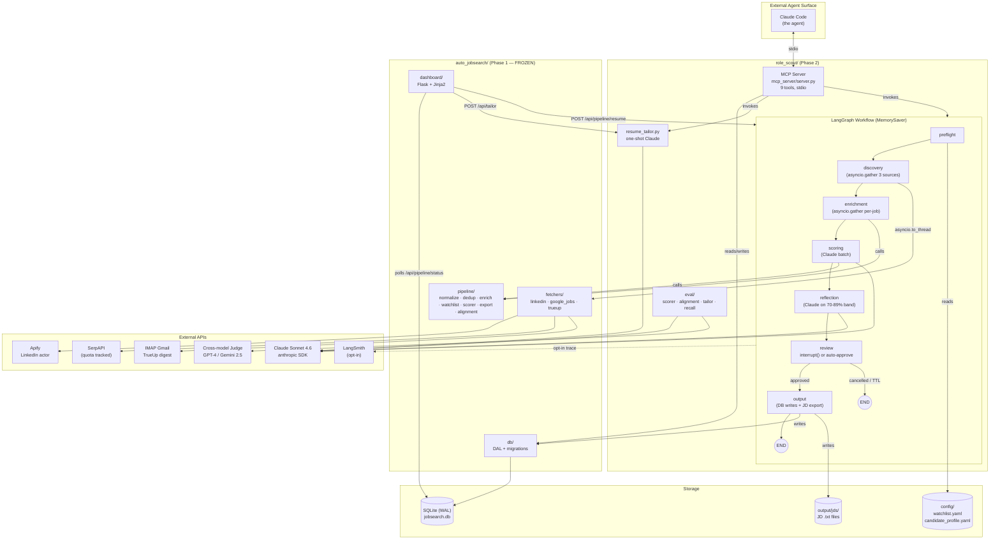

> **HISTORICAL DOCUMENT** — This file reflects the design decisions made before implementation. The codebase has since evolved: Phase 1 (auto_jobsearch) is now absorbed into `role_scout/compat/` as a frozen sub-package; there is no sibling repo dependency. Treat this as design context, not current truth.

---

# TECH-DESIGN: Role Scout Phase 2

| Field | Value |
|-------|-------|
| Parent | [PRD-CORE.md](./PRD-CORE.md) |
| Version | 1.0 |
| Owner | [project-owner] |
| Status | Approved |
| Updated | 2026-04-23 |

---

## 1. Architecture

### 1.1 System Diagram (Mermaid)



### 1.2 System Diagram (ASCII fallback)

```
┌─────────────────────────┐
│  Claude Code (agent)    │
└──────────┬──────────────┘
           │ stdio MCP
           ▼
┌──────────────────────────────────────────────────────────────────────────┐
│  role_scout/                                                              │
│  ┌────────────────┐     ┌──────────────────────────────────────────────┐ │
│  │ MCP Server     │     │  LangGraph Workflow (MemorySaver)             │ │
│  │  9 tools       │◄───►│                                                │ │
│  └────────────────┘     │  preflight → discovery → enrichment            │ │
│                         │       (asyncio.gather 3 sources / per-job)     │ │
│                         │          ↓                                     │ │
│                         │       scoring → reflection → review            │ │
│                         │                              (interrupt())    │ │
│                         │          ┌─ approved → output → END            │ │
│                         │          └─ cancelled/TTL → END                │ │
│                         └──────────────────────────────────────────────┘ │
│  ┌────────────────┐     ┌──────────────────┐                             │
│  │ resume_tailor  │     │ eval/            │                             │
│  │ (one-shot)     │     │ scorer·alignment │                             │
│  └────────────────┘     │ tailor·recall    │                             │
│                         └──────────────────┘                             │
└────────┬──────────────────────┬──────────────────────────┬───────────────┘
         │ imports              │                          │
         ▼                      │                          ▼
┌────────────────────────────┐  │   ┌────────────────────────────────────┐
│ auto_jobsearch/ (FROZEN)   │  │   │ External APIs                      │
│  fetchers · pipeline · db  │  │   │ Claude · GPT-4/Gemini · SerpAPI    │
│  dashboard (Flask)         │  │   │ Apify · IMAP · LangSmith (opt)     │
└──────────┬─────────────────┘  │   └────────────────────────────────────┘
           │                     │
           ▼                     ▼
┌────────────────────────────────────────────────┐
│ SQLite (WAL) · output/jds/ · config/*.yaml     │
└────────────────────────────────────────────────┘
```

### 1.3 Components

| Component | Responsibility | Technology | Scaling |
|-----------|----------------|------------|---------|
| LangGraph workflow | Orchestrates 6 nodes + reflection subgraph; HiTL interrupt; conditional routing | `langgraph>=0.2.0`, `MemorySaver` | Single-process; in-memory state; 4h TTL cap |
| MCP server | Exposes 9 tools to Claude Code over stdio | `mcp==1.0.x` | One-at-a-time via single-writer DB lock |
| Resume tailor | One-shot Claude call with cache-key staleness protection | `anthropic` SDK | On-demand; cache in `qualified_jobs.tailored_resume` |
| Eval harness | 4 evals, cross-model judge, gates promotion | `scipy`, `openai` OR `google-generativeai` | Offline CLI |
| Phase 1 (frozen) | Fetchers, pipeline ops, DAL, Flask dashboard | Existing — unchanged | Untouched |
| Flask dashboard (enhanced) | Slider (client-side filter), watchlist CRUD, HiTL banner, Tailor button | Existing Flask + Jinja2 + CSRF | Single-user localhost |
| SQLite | All persistence | `sqlite3` WAL mode | Single-writer; concurrent readers OK |

---

## 2. Agentic Pattern (explicit)

**Pattern:** Orchestrator-Workers DAG + HiTL interrupt + Reflection subgraph + external Tool-Using Agent (Claude Code via MCP).

**NOT used (rejected with rationale in ADRs):**
- ReAct on discovery — decision surface too small (3 sources)
- Planner-Executor on tailoring — one-shot baseline not proven insufficient
- Supervisor-Worker multi-agent — gratuitous complexity for a deterministic pipeline

**The one genuine agent in this system is Claude Code itself**, invoking MCP tools. The LangGraph workflow is a stateful orchestrator with a single self-critique loop (reflection on scoring).

---

## 3. Key Interfaces

### 3.1 State Schema (`JobSearchState`)

```python
from typing import TypedDict, Optional, Literal
from datetime import datetime
from jobsearch.models import CandidateProfile, NormalizedJob, ScoredJob

class JobSearchState(TypedDict):
    # Immutable across nodes
    run_id: str                                   # uuid4
    trigger_type: Literal["manual", "scheduled", "mcp", "dry_run"]
    started_at: datetime
    candidate_profile: CandidateProfile
    watchlist: list[str]
    qualify_threshold: int                        # from .env SCORE_THRESHOLD; NOT mutated on slider change
    run_mode: Literal["linear", "agentic", "shadow"]   # feature flag

    # Populated by discovery (TRIMMED after enrichment)
    raw_by_source: dict[str, list[dict]]          # TRIMMED to {} after enrichment_node
    normalized_jobs: list[NormalizedJob]          # TRIMMED to [] after enrichment_node
    new_jobs: list[NormalizedJob]                 # post-dedup; TRIMMED to [] after enrichment_node
    source_counts: dict[str, int]                 # retained
    source_health: dict[str, dict]                # retained; written to run_log.source_health_json

    # Populated by enrichment
    enriched_jobs: list[NormalizedJob]            # TRIMMED to [] after scoring_node

    # Populated by scoring + reflection
    watchlist_hits: dict[str, int]
    scored_jobs: list[ScoredJob]                  # retained through review_node
    scoring_tokens_in: int
    scoring_tokens_out: int
    reflection_tokens_in: int
    reflection_tokens_out: int
    reflection_applied_count: int                 # diagnostic

    # Populated by review
    human_approved: bool
    cancel_reason: Optional[Literal["user_cancel", "ttl_expired", "crippled_fetch", "cost_kill_switch"]]
    ttl_deadline: datetime                        # started_at + 4h (or + 2h if extended once)
    ttl_extended: bool                            # single extension limit

    # Populated by output
    exported_count: int
    total_cost_usd: float

    # Accumulated across nodes
    errors: list[str]                             # append-only
```

### 3.2 State Size Bounds (trimming rules)

| After node | Keep | Trim to empty |
|-----------|------|---------------|
| `preflight` | all state | — |
| `discovery` | `raw_by_source`, `normalized_jobs`, `new_jobs`, `source_counts`, `source_health` | — |
| `enrichment` | `enriched_jobs`, `watchlist_hits`, `source_counts`, `source_health`, `errors` | `raw_by_source`, `normalized_jobs`, `new_jobs` |
| `scoring` | `scored_jobs`, `scoring_tokens_in/out`, core metadata | `enriched_jobs` |
| `reflection` | `scored_jobs` (updated), `reflection_tokens_in/out`, `reflection_applied_count` | — |
| `review` | `human_approved`, `cancel_reason`, `scored_jobs` (only those ≥ threshold for output) | — |
| `output` | `exported_count`, `total_cost_usd`, `errors` | `scored_jobs` (after writes complete) |

**Assertion in every node:** `assert len(json.dumps(state, default=str).encode()) < 10 * 1024 * 1024`. Fail run with `StateSizeExceeded` error.

### 3.3 Node Interfaces (Protocol-style)

```python
class Node(Protocol):
    async def __call__(self, state: JobSearchState) -> JobSearchState: ...
```

### 3.4 Reflection Subgraph (F2)

```python
BORDERLINE_LOW, BORDERLINE_HIGH = 70, 89

async def reflection_node(state: JobSearchState) -> JobSearchState:
    borderline = [j for j in state["scored_jobs"]
                  if BORDERLINE_LOW <= j.match_pct <= BORDERLINE_HIGH]
    if not borderline or not settings.REFLECTION_ENABLED:
        return state
    revised = await asyncio.gather(*[reflect_one(j, state["candidate_profile"]) for j in borderline])
    # Merge revised scores back into scored_jobs, preserving non-borderline items
    ...
```

### 3.5 MCP Tool Contracts

See [SPEC §4.2](./SPEC.md#42-tool-contracts). Each tool has a typed Pydantic input + output model in `role_scout/mcp_server/schemas.py`.

---

## 4. Security

### 4.1 Threat Model

| Asset | Threat | L | I | Controls |
|-------|--------|---|---|----------|
| `.env` (API keys) | Leak to git | M | H | Gitignored; secret-scan hook in CLAUDE.md pipeline |
| `candidate_profile.yaml` | PII leak via logs | M | M | Never logged; structlog filter |
| SQLite DB | Read by another local process | L | L | File perms 600; localhost-only |
| Flask dashboard | Exposed beyond localhost | M | H | `host="127.0.0.1"` enforced; test T37 fails on 0.0.0.0 |
| Flask write routes | CSRF attack from malicious site | M | M | Flask-WTF CSRF on all POST/DELETE |
| MCP server | Arbitrary tool invocation by non-intended agent | L | M | stdio only; no network transport |
| Cost kill-switch | Malicious prompt injection causing high-token outputs | L | M | `MAX_COST_USD` env kill-switch; per-call token cap |
| `watchlist.yaml` write | Concurrent-write corruption | L | L | tempfile + atomic rename |

### 4.2 Auth Matrix

Single-user localhost app. No user accounts. Auth = "did the request come from localhost (127.0.0.1) with a valid CSRF token (for state changes)?"

| Resource | Read | Write | Delete |
|----------|------|-------|--------|
| `/api/pipeline/status` | localhost | — | — |
| `/api/pipeline/resume`, `/extend` | — | localhost + CSRF | — |
| `/api/tailor/<hash_id>` | — | localhost + CSRF | — |
| `/api/watchlist` | — | localhost + CSRF | — |
| `/api/watchlist/<company>` | — | — | localhost + CSRF |
| `/api/config/threshold` | — | — (client-side only) | — |
| MCP stdio tools | process-local | process-local | process-local |

### 4.3 Input Validation

| Input | Validation | Sanitization |
|-------|------------|--------------|
| `hash_id` path param | `^[a-f0-9]{16}$` regex | N/A |
| `company` path/body | max 100 chars, strip, reject if contains newline | trim whitespace |
| `force` bool | Pydantic `bool` coercion | N/A |
| `threshold` (display only) | int 75–95 | clamp |
| `cancel_reason` | Literal enum | N/A |
| MCP tool inputs | Pydantic model per tool | N/A |

### 4.4 Data Protection

| Data | Classification | At Rest | Transit | Retention |
|------|----------------|---------|---------|-----------|
| API keys | Secret | `.env`, gitignored | env only; never logged | Until rotated |
| Candidate profile | PII (self) | yaml, gitignored | read into state, never logged | Until user removes |
| Job descriptions | Public | SQLite + JD files | Claude API, LangSmith (opt-in) | 60-day TTL via `expire_old_hashes` |
| Tailored resumes | Derived PII | `qualified_jobs.tailored_resume` column | Claude API | Until `resume_summary.md` or prompt changes (cache bust) |
| Run logs | Operational | `run_log` table | — | 90 days (new cleanup job) |
| LangSmith traces | Job descriptions + prompts | External SaaS | HTTPS | Governed by LangSmith project retention |

---

## 5. Infrastructure

### 5.1 Configuration (`role_scout/settings.py` — `pydantic-settings`)

| Variable | Type | Required | Default | Sensitive |
|----------|------|----------|---------|-----------|
| `ANTHROPIC_API_KEY` | str | yes | — | ✓ |
| `OPENAI_API_KEY` OR `GOOGLE_API_KEY` | str | yes (for eval) | — | ✓ |
| `SERPAPI_KEY` | str | yes | — | ✓ |
| `APIFY_TOKEN` | str | yes | — | ✓ |
| `IMAP_EMAIL` / `IMAP_APP_PASSWORD` | str | yes (for trueup) | — | ✓ |
| `SCORE_THRESHOLD` | int | no | 85 | ✗ |
| `REFLECTION_ENABLED` | bool | no | true | ✗ |
| `RUN_MODE` | `linear\|agentic\|shadow` | no | shadow (for first 2 wks) | ✗ |
| `MAX_COST_USD` | float | no | 5.00 | ✗ |
| `INTERRUPT_TTL_HOURS` | float | no | 4.0 | ✗ |
| `LANGSMITH_TRACING` | bool | no | false | ✗ |
| `LANGSMITH_API_KEY` | str | if tracing | — | ✓ |
| `LANGSMITH_PROJECT` | str | no | role_scout | ✗ |
| `LOG_LEVEL` | str | no | INFO | ✗ |
| `LOG_FILE` | path | no | stderr | ✗ |
| `DB_PATH` | path | no | output/jobsearch.db | ✗ |
| `REFLECTION_BAND_LOW` / `_HIGH` | int | no | 70 / 89 | ✗ |
| `SERPAPI_MIN_QUOTA` | int | no | 10 | ✗ |
| `SOURCE_HEALTH_WINDOW` | int | no | 3 (last N runs) | ✗ |

### 5.2 SQLite Configuration

On `init_db()`:

```python
conn.execute("PRAGMA journal_mode=WAL;")
conn.execute("PRAGMA synchronous=NORMAL;")
conn.execute("PRAGMA busy_timeout=5000;")
conn.execute("PRAGMA foreign_keys=ON;")
```

**Dashboard read-only connection:** `sqlite3.connect(DB_PATH, uri=True, ...)` with URI `file:{DB_PATH}?mode=ro`.

### 5.3 DB Migration Plan (additive only)

All migrations in `role_scout/migrations.py`, run at init:

```python
MIGRATIONS = [
    "ALTER TABLE qualified_jobs ADD COLUMN tailored_resume TEXT",
    "ALTER TABLE run_log ADD COLUMN input_tokens INTEGER DEFAULT 0",
    "ALTER TABLE run_log ADD COLUMN output_tokens INTEGER DEFAULT 0",
    "ALTER TABLE run_log ADD COLUMN estimated_cost_usd REAL DEFAULT 0.0",
    "ALTER TABLE run_log ADD COLUMN source_health_json TEXT",
    "ALTER TABLE run_log ADD COLUMN trigger_type TEXT DEFAULT 'manual'",
    "ALTER TABLE run_log ADD COLUMN ttl_deadline TEXT",
    "ALTER TABLE run_log ADD COLUMN ttl_extended INTEGER DEFAULT 0",
]

for sql in MIGRATIONS:
    try:
        conn.execute(sql)
    except sqlite3.OperationalError as e:
        if "duplicate column name" not in str(e):
            raise
```

No destructive changes. No rewrite of Phase 1 schema.

### 5.4 Monitoring

| Metric | Alert Condition | Severity | Response |
|--------|-----------------|----------|----------|
| `run_log.status=failed` | Any | M | Check structlog for node-level error |
| `estimated_cost_usd > 2.0` | Any single run | L | Dashboard yellow banner |
| `estimated_cost_usd > MAX_COST_USD` | Any single run | H | Kill-switch aborts; investigate prompt |
| Source failed 3 consecutive runs | `source_health_json` check | M | Dashboard warning + auto-skip |
| SerpAPI quota < `SERPAPI_MIN_QUOTA` | Preflight check | M | Skip google_jobs, log warning |
| TTL auto-cancel | `cancel_reason=ttl_expired` | L | Log only; user knows to re-run |
| p95 run duration > 3 min | Over last 10 runs | L | Investigate slow source |
| `RUN_MODE=shadow` diff detected | Shadow comparison logs | H | Block promotion; investigate divergence |

### 5.5 launchd Integration

`config/com.jobsearch.agent.plist` updated:

```xml
<key>ProgramArguments</key>
<array>
    <string>/usr/local/bin/uv</string>
    <string>run</string>
    <string>--directory</string>
    <string>/path/to/role_scout</string>
    <string>python</string>
    <string>run.py</string>
    <string>--agentic</string>
    <string>--auto-approve</string>
</array>
```

Schedule Mon/Thu 08:00 unchanged.

---

## 6. Decisions (ADRs)

| ID | Decision | Options Considered | Choice | Rationale |
|----|----------|---------------------|--------|-----------|
| ADR-1 | Orchestration substrate | LangGraph / Temporal / Airflow / custom asyncio | **LangGraph** | Native interrupt/resume, minimal infra, Python-native |
| ADR-2 | Checkpointer | MemorySaver / SqliteSaver | **MemorySaver** (Phase 2) | 4h TTL + single-user interactive use makes crash-recovery unnecessary; SqliteSaver deferred to Phase 3 |
| ADR-3 | Agentic surface | Build chat UI / MCP / REST | **MCP** | Claude Code integration is the user's natural agent; no chat UI to build |
| ADR-4 | Reflection scope | None / scoring-only / scoring+tailoring / all Claude calls | **Scoring-only, borderline 75–89%** | Highest volume × evidence of errors × measurability; tailoring has user-as-QA, discovery has no real decision |
| ADR-5 | Tailoring pattern | One-shot / Planner-Executor | **One-shot** | User edits output; no evidence one-shot fails; 3–5× cost for Planner-Executor unjustified; eval gate can flip this later |
| ADR-6 | Discovery routing | ReAct / rules / none | **Deterministic rules** (source health, quota, query log) | 3-source decision surface too small for ReAct value |
| ADR-7 | Threshold slider | Re-score on change / display-filter only | **Display-filter only** | Re-score burns $ and contradicts "slider is live UI control"; threshold is a view, not a model input |
| ADR-8 | MCP `run_pipeline` HiTL | Hold connection / poll / auto-approve | **Auto-approve** | MCP tools are request/response; response includes exported_count and cost so Claude Code can show the user |
| ADR-9 | HiTL single source of truth | CLI / Flask banner / both | **Flask banner is primary**; CLI fallback only when `--agentic` runs without `--serve` | Scheduled/MCP runs auto-approve; interactive run expects dashboard |
| ADR-10 | Scheduled vs interactive code path | Two scripts / one script with flag | **One** (`run.py --agentic [--auto-approve]`) | Avoid prod/dev drift |
| ADR-11 | State bloat | Keep all intermediates / trim progressively | **Progressive trimming** with 10 MB cap assertion | Smaller state = cheaper checkpoint + faster resume |
| ADR-12 | Interrupt TTL | None / 1h / 4h / 24h | **4h** with single 2h extension | Long enough for same-day review; short enough to avoid stale state; extension covers lunch/meeting gaps |
| ADR-13 | Eval size | 20 / 50+ / 100+ | **50+** (target 75) | 20 is too few for stable Spearman CI |
| ADR-14 | Judge model | Same family (Claude) / cross-family | **Cross-family** (GPT-4 or Gemini 2.5) | Avoid self-preference bias |
| ADR-15 | Rollout strategy | Direct flip / shadow / canary | **Shadow 2 weeks, then flip** | High confidence without risking weekly pipeline |
| ADR-16 | DB migration | Drop+recreate / alembic / additive ALTER | **Additive ALTER only** | Zero-downtime, idempotent, safe on existing DB |
| ADR-17 | Logging library | stdlib logging / loguru / structlog | **structlog** | CLAUDE.md mandate; Phase 1 already uses |
| ADR-18 | Tracing | Always-on / opt-in / never | **Opt-in LangSmith** | Zero runtime cost when off; available when debugging graph |
| ADR-19 | Prompts location | Unified in one dir / split (Phase 1 vs Phase 2) | **Split** (`auto_jobsearch/prompts/` for frozen, `role_scout/prompts/` for new) | Keeps frozen codebase truly frozen |
| ADR-20 | Flask vs Streamlit | Rewrite in Streamlit / enhance Flask | **Enhance Flask** | Phase 1 Flask handles expand rows, CSRF, downloads — Streamlit regresses these |

---

## 7. Testing Strategy

### 7.1 Layers

| Layer | Target | Tooling |
|-------|--------|---------|
| Unit — nodes | Mock state in/out; mock Claude; mock DAL | pytest + fixtures |
| Unit — MCP tools | Each of 9 tools against fixture DB | pytest |
| Unit — tailor | Cache key semantics, force bypass, prompt version bump | pytest |
| Integration — graph | Full end-to-end with mocked external APIs, mocked Claude returning canned responses | pytest-asyncio |
| Integration — interrupt | TTL=1s expiry, user approve, user cancel, extend | pytest-asyncio |
| E2E — dashboard | Browser automation of banner, slider, watchlist, Tailor | Playwright |
| Eval — scorer / alignment / tailor / recall | CLI with ground truth | `uv run python eval/run_eval.py` |
| Shadow-mode regression | Run linear + agentic on same input, diff scored_jobs | `scripts/shadow_diff.py` (cron nightly) |

### 7.2 Coverage Target

**80% line coverage on `role_scout/`**, enforced by `pytest-cov --cov-fail-under=80` in CI.

### 7.3 Determinism

All graph tests set `random.seed(0)` and use canned Claude responses. No live API calls in CI.

### 7.4 Concurrency Test (Day 2 gate)

`tests/test_concurrency.py` runs 3 TrueUp IMAP fetches concurrently via `asyncio.gather(asyncio.to_thread(...))` and asserts each opens its own connection (no shared state, no `mailbox already selected` errors).

---

## 8. Rollback / Shadow Mode

### 8.1 Feature Flag

`RUN_MODE` env var:
- `linear` — only the Phase 1 orchestrator runs. No graph code invoked.
- `agentic` — only the graph runs.
- `shadow` (default for 2 weeks) — graph runs normally AND linear orchestrator runs in a separate thread on the **same input**. Results compared; differences logged to `shadow_diffs/YYYY-MM-DD-<run_id>.json`.

### 8.2 Shadow Diff Script (`scripts/shadow_diff.py`)

Compares:
- `scored_jobs` set (by hash_id): symmetric difference must be empty.
- Per-job `match_pct`: absolute difference > 2 is flagged.
- Exported JDs: file set must match.

GIVEN 14 consecutive runs in shadow mode with zero unexplained diffs
WHEN eval gates (F5) all pass
THEN the default flips to `RUN_MODE=agentic` via a commit updating `.env.example`
AND `linear` orchestrator remains callable via `RUN_MODE=linear` as emergency rollback

### 8.3 Rollback Criteria

Auto-rollback to `linear` if, in any single run after flip:
- `RUN_MODE=agentic` run fails with `status=failed`
- Cost > $5 (kill switch fires)
- Eval suite regresses by ≥ 0.05 Spearman

Manual user command: `echo 'RUN_MODE=linear' >> .env` — takes effect on next run.

---

## 9. Observability Architecture

### 9.1 Correlation ID Flow

```
run.py startup → generate run_id (uuid4)
           ↓
    structlog.bind(run_id=run_id)
           ↓
    all node logs, DAL calls, HTTP logs include run_id
           ↓
    run_log.run_id stored in DB
           ↓
    Dashboard retrieves logs by run_id
```

Dashboard request logs use a separate `request_id` (Flask `before_request` hook) in addition to `run_id` when the request is tied to a pipeline operation (e.g., `/api/pipeline/resume?run_id=...`).

### 9.2 Log Schema (every line)

```json
{
  "timestamp": "2026-04-23T08:00:03.123Z",
  "level": "info",
  "event": "scoring_batch_completed",
  "correlation_id": "a1b2c3d4-...",
  "node": "scoring",
  "jobs_scored": 42,
  "tokens_in": 82000,
  "tokens_out": 6400,
  "duration_ms": 18234
}
```

### 9.3 LangSmith (opt-in)

Wrapper in `role_scout/tracing.py`:

```python
def maybe_traced(fn):
    if settings.LANGSMITH_TRACING:
        from langsmith import traceable
        return traceable(fn)
    return fn
```

Applied to each node. Zero overhead when off (identity wrapper).

### 9.4 Cost Accounting

Every Claude call passes through `role_scout/cost.py`:

```python
async def call_claude(model: str, messages: list, *, state: JobSearchState) -> Response:
    resp = await client.messages.create(model=model, messages=messages, ...)
    state["scoring_tokens_in"] += resp.usage.input_tokens
    state["scoring_tokens_out"] += resp.usage.output_tokens
    running_cost = compute_cost(state)
    if running_cost > settings.MAX_COST_USD:
        raise CostKillSwitchError(f"cost {running_cost} > cap {settings.MAX_COST_USD}")
    return resp
```

`output_node` writes final tallies to `run_log`.

---

## 10. Risks

| # | Risk | Likelihood | Impact | Mitigation |
|---|------|------------|--------|------------|
| 1 | Reflection doesn't improve Spearman | M | M | Eval gate ≥ +0.05; else disable via `REFLECTION_ENABLED=false` |
| 2 | Shadow mode diffs are unexplainable | L | H | Block promotion; structured diff log shows per-job delta |
| 3 | MemorySaver state lost on reboot mid-interrupt | M | M | 4h TTL + dashboard shows countdown; user knows to re-run |
| 4 | MCP SDK breaks on upgrade | L | M | Pin exact version; smoke test before bump |
| 5 | SQLite write contention with Flask polling | L | M | WAL mode + 5s poll interval + read-only dashboard conns |
| 6 | `MAX_COST_USD` too low aborts healthy runs | L | L | Default $5 is 2.5× target; adjust in `.env` if needed |
| 7 | Cross-model judge API outage breaks eval | L | L | Eval is offline; retry; skip with warning, don't block other evals |
| 8 | Additive migration sequence run out of order on fresh DB | L | M | `init_db()` applies all migrations on every start; try/except makes each idempotent |
| 9 | Phase 1 schema evolves despite "frozen" stance | L | H | Policy enforced: no PRs to `auto_jobsearch/` during Phase 2; CI check can be added if violated |
| 10 | Dashboard polling overwhelms SQLite when opened in multiple tabs | L | L | Recommend single-tab use; no enforcement |

---

## 11. Non-Goals (explicit)

- Multi-user auth / SSO
- Cloud deployment — this is a local macOS app
- WebSocket / SSE — 5s polling is sufficient for solo-user dashboard
- Redis / external queue — SQLite WAL is adequate for single-writer pattern
- Kubernetes / Docker orchestration — out of scope for local dev
- Real-time job-posting ingestion — Mon/Thu cadence is the product
