# Role Scout — Agentic Pipeline Diagram

Paste the code block below into [mermaid.live](https://mermaid.live) to render interactively,
or view it directly in any Markdown renderer that supports Mermaid (GitHub, Obsidian, VS Code).

```mermaid
flowchart TD
    START(["Pipeline Start
    manual · scheduled · MCP · dry-run"])

    subgraph PF["① PREFLIGHT"]
        PF1["`Validate API keys & sources
        Init DB · insert run_log row`"]
        PF2{"2+ sources failed?"}
        PF1 --> PF2
    end

    subgraph DI["② DISCOVERY"]
        DI1["`Fetch in parallel
        LinkedIn · Google Jobs · TrueUp`"]
        DI2["`Dedup against seen_hashes
        Normalize · record source health`"]
        DI1 --> DI2
    end

    subgraph EN["③ ENRICHMENT"]
        EN1["Fetch full job description text for each new listing"]
    end

    subgraph SC["④ SCORING — Claude"]
        SC0{"Cost > MAX_COST_USD?"}
        SC1["`Score batches of 10 jobs
        **match_pct 0–100** vs candidate profile
        Sub-scores: Seniority · Domain · Location · Stage · Comp`"]
        SC2{"match_pct range?"}
        SC0 -->|No — proceed| SC1
        SC1 --> SC2
    end

    subgraph RF["⑤ REFLECTION — Claude"]
        RF1{"Borderline jobs 75–89%?"}
        RF2["`Second Claude pass per borderline job
        Original score + sub-scores shown to Claude
        Check for inconsistencies · Score may move **up or down**`"]
        RF3{"Score >= threshold?"}
        RF1 -->|Yes| RF2
        RF2 --> RF3
    end

    subgraph RV["⑥ REVIEW — HiTL"]
        RV1["`**LangGraph interrupt**
        Write review_pending to DB
        Record qualified count · cost · top matches`"]
        RV2["`Dashboard polls every 5s → shows banner
        Qualified count · estimated cost · top 3 matches
        TTL countdown (default 4 hours)`"]
        RV3{"Human decision?"}
        RV1 --> RV2
        RV2 --> RV3
    end

    subgraph OP["⑦ OUTPUT"]
        OPA["`Insert qualified jobs into DB
        Write JDs to output/jds/
        Update run_log: **completed**`"]
        OPB["`Update run_log: **cancelled**
        Record cancel_reason · no jobs written`"]
    end

    DONE(["Jobs visible in dashboard
    status=new · sortable · filterable"])
    ABORT(["Run ended — no export
    Re-run when ready"])

    %% Main flow
    START --> PF1
    PF2 -->|No — all sources healthy| DI1
    DI2 --> EN1
    EN1 --> SC0

    %% Score bands — all three feed into Reflection
    SC2 -->|">= 85%  QUALIFIED"| RF1
    SC2 -->|"75–89%  BORDERLINE"| RF1
    SC2 -->|"< 75%  DROPPED"| RF1

    %% Reflection outcomes
    RF1 -->|No borderline jobs| RV1
    RF3 -->|"Yes — promoted to qualified"| RV1
    RF3 -->|"No — stays dropped"| RV1

    %% HiTL outcomes
    RV3 -->|"Approved  (key: A)"| OPA
    RV3 -->|"Cancelled  (key: Esc)"| OPB
    RV3 -->|"TTL expired — auto-cancel"| OPB

    OPA --> DONE
    OPB --> ABORT

    %% Short-circuit exits — bypass rest of pipeline
    PF2 -->|"Yes — circuit breaker"| OPB
    SC0 -->|"Yes — cost kill-switch"| OPB

    %% Colour coding
    style PF    fill:#1b3a5c,color:#daeaf7,stroke:#2e86c1,stroke-width:2px
    style DI    fill:#1b3a5c,color:#daeaf7,stroke:#2e86c1,stroke-width:2px
    style EN    fill:#1b3a5c,color:#daeaf7,stroke:#2e86c1,stroke-width:2px
    style SC    fill:#4a1a6e,color:#ede0f5,stroke:#8e44ad,stroke-width:2px
    style RF    fill:#4a1a6e,color:#ede0f5,stroke:#8e44ad,stroke-width:2px
    style RV    fill:#174a30,color:#d5f5e3,stroke:#27ae60,stroke-width:2px
    style OP    fill:#2d2d2d,color:#ececec,stroke:#666,stroke-width:2px
    style START fill:#1a252f,color:#d6eaf8,stroke:#5d6d7e,stroke-width:2px
    style DONE  fill:#145a32,color:#ffffff,stroke:#1e8449,stroke-width:2px
    style ABORT fill:#641e16,color:#ffffff,stroke:#922b21,stroke-width:2px
```

